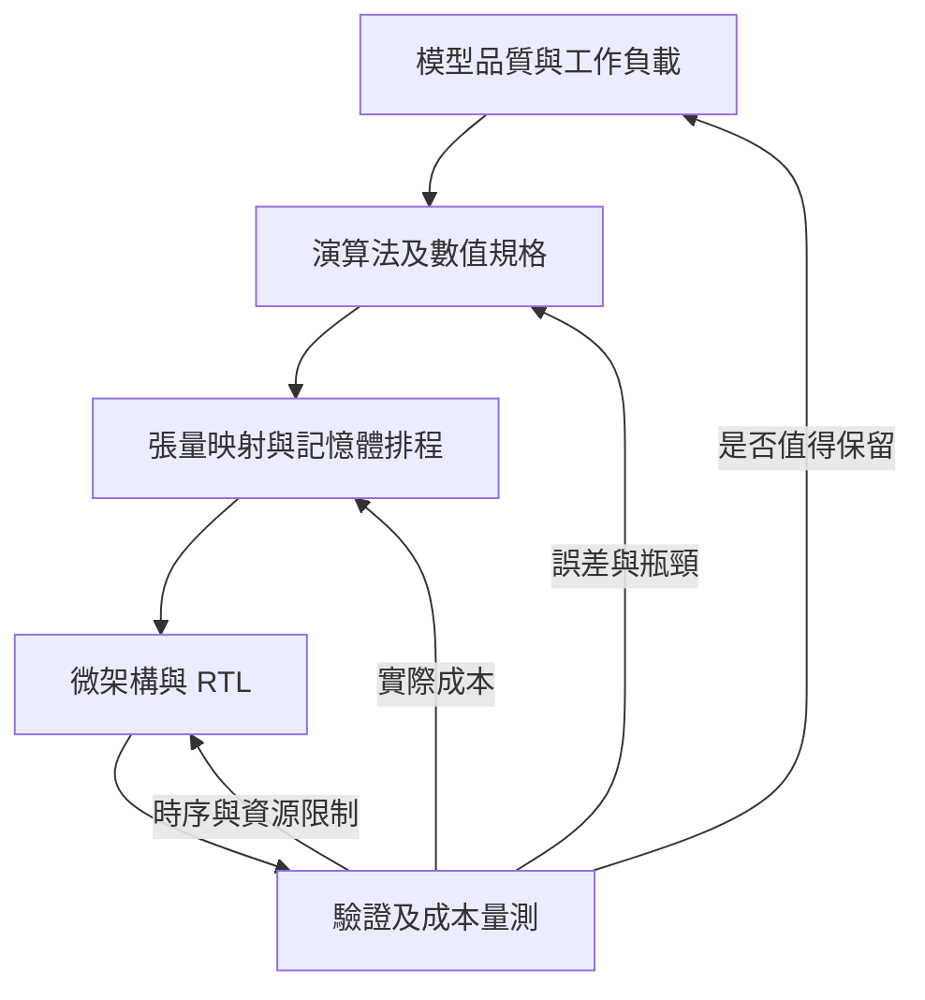

# LLM Lab：以工作負載驅動的演算法與 NPU 共同設計

本專案總目標是深刻理解 LLM，完整學習順序以 [學習規劃](learning-plan.md) 為準。本文件定義第三層「NPU 部署與加速」的共同設計路線：在理解表示、學習、attention 與生成後，從同一個模型的運算需求推導數值格式、資料流、記憶體、指令與 RTL，再將正確性與成本結果回饋到模型。

小模型訓練與 held-out 評估是這條路線的前置基礎；不延到硬體完成後才補。先完成 LLM 理解主線的讀者可以暫停在那裡；想走完整共同設計路線者，保留 Python 驅動自有 RTL 的終點，不需要 tape-out。

**llm-lab 是唯一主線。NanoNPU 是可讀取、可比較的參考實作，不是本專案的規格、編譯目標或架構上限。** 不要求複製其 ISA、UART/APB、array size、CNN pipeline 或製程。實驗預設不需 clone/build NanoNPU；不將它設為 submodule。

## 從什麼問題出發

同一個線性層 Y=XW，prefill 的 X 有許多列，單序列 decode 的 X 通常只有一列。兩者雖共享權重與數學公式，在陣列填充、權重重用與頻寬上卻可能有不同需求。因此先問「工作負載的 shape 與資料重用是什麼」，再決定是否需要更多乘法器。

每一輪設計都沿著這個閉環：

例如改成 INT4，必須一起回答：模型品質損失多少、scale 如何表示、MAC 如何處理、SRAM 如何打包、反量化放在哪裡、讀取量減少是否真的縮短端到端延遲。只改資料型別或只增加一個 RTL 模組，不算完成共同設計。

## 我們自己的起始決策

| 項目 | 起始選擇 | 選擇原因與何時重審 |
| --- | --- | --- |
| 模型 | 可檢查的小型 decoder-only Transformer | 能跑完整正確性閉環；之後另訓練小模型驗證品質 |
| 第一個算子 | GEMM / GEMV | 連到 QKV、FFN、LM head；最容易建立獨立 golden reference |
| 整數基準 | INT8×INT8、INT32 累加、明確溢位/重定量語意 | 先控制 bit-level 差異；不代表最終模型全部 INT8 |
| 第一個時序模型 | 參數化 weight-stationary mesh | 便於看見資料傳播；後續必須與 output-stationary 比較 |
| 第一個 RTL 單元 | 自行撰寫的 WS PE，具明確 enable | 將數值與停頓規格寫清楚，不照搬參考介面 |
| 執行分工 | 初期 host 負責 tokenizer、sampling 與未支援算子 | 先加速明確 kernel，再逐步減少 fallback |
| 記憶體/ISA | 由 shape、liveness、流量與同步推導 | 尚未承諾特定 bus、指令編碼或 cache layout |
| 製程/板卡 | 功能與時序驗證初期不綁製程 | FPGA 或 open-source PDK 需在對應階段選定並記錄 |

這些是可被實驗推翻的起點，不是最終晶片規格。尤其 SRAM 容量、時脈與運算陣列大小，不能從參考 README 複製後當成設計結論。

## 每個技術題目需交付的證據

1. 一個具體瓶頸與固定工作負載：shape、數值分布、batch、context。
2. 數學規格與浮點 golden model。
3. 整數或近似模型：signedness、scale、rounding、saturation、overflow。
4. 資料流與逐 cycle 規格：valid/ready、stall、reset、tile 邊界。
5. RTL 或明確標示層級的模擬器，以及獨立比對方式。
6. 成本報告：有效 MAC、總 cycles、SRAM/外部 bytes、利用率、誤差。
7. 物理階段再加入 area、clock constraints、STA 與有條件的 power estimate。
8. 設計結論：保留/放棄哪個方案，以及下一個實驗。

每次只要求本階段能實際產生的證據，但未完成欄位必須明列。Python 自洽測試不等於 RTL 等價，RTL simulation 不等於 synthesis，synthesis area 不等於 post-route PPA；沒有 activity/library 的功耗不能寫成量測值。

## Reference 的使用方式

NanoNPU 幫助我們理解一個有限規模設計如何接起 PE、buffer、控制、host 與後端流程。遇到同一個問題，先讀其實作，再記錄採用、修改或捨棄的理由。引用固定 commit 與路徑，不能混用不同 RTL source set。

若要直接移植程式碼，先確認並保留授權與來源。本次只記錄 source pin/審查結果，新增的 Python、RTL 與 testbench 為本專案教學實作。完整參考記錄見 [NanoNPU source review](nanonpu-reference-review.md)。

更大系統的參照可延伸到 [Gemmini](https://github.com/ucb-bar/gemmini)：特別是 compiler、SoC、記憶體與加速器互相影響的評估方式。它同樣是比較對象，不取代本專案主線。

## 第三層的最終成果：完成部署並驗證加速

先完成一個可重現的小型 Transformer 軟硬體共同執行系統：有真實模型輸入/輸出、host fallback 邊界、可驗證 kernel、compiled schedule，以及能解釋的效能報告。再以相同工作負載比較陣列、精度、SRAM 與 attention 執行方案。

目標是「能根據證據設計與取捨」，不是把 NanoNPU 包裝成能直接執行任意 LLM 的產品。課程章節與程式都維持在本 repo 演進。
