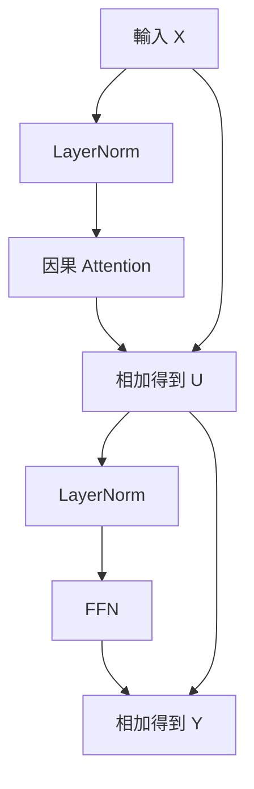

# 09｜Attention 之外，一個 Transformer block 還做什麼？

Attention 負責跨位置讀取，但讀到資訊後，每個位置還需要加工。Feed-forward network（FFN）對每個位置使用同一套參數，先改變向量寬度，經過非線性函數，再投影回來。

本實驗採用簡化的 pre-norm block：

$$U=X+\mathrm{Attention}(\mathrm{LN}(X))$$
$$Y=U+\mathrm{ReLU}(\mathrm{LN}(U)W_1)W_2$$

ReLU 把負數變成零，正數保留。這個非線性步驟使兩次矩陣乘法無法簡單合成一次。正式模型也可能採 GELU、SwiGLU 等不同形式。

加回 X 或 U 的路徑叫 residual connection。模型不必每層都重新建立全部資訊，而可以學習在原表示上加一份更新；這也改善深層網路訓練時的梯度傳遞。

LN 是 LayerNorm：對每個 token 的通道計算平均與變異，做正規化，再可加上可學習縮放與偏移。本程式固定縮放為 1、偏移為 0。其他模型可能使用 RMSNorm，它不減掉平均值；不能把不同模型的 block 細節視為完全相同。

堆疊多個 block，讓後層在前層已整合的表示上再運算。參數更多不代表每層有人工指定的工作，例如「第 3 層處理文法」通常不是架構保證。

**練習：** 如果 FFN 中間沒有非線性，兩次投影有何限制？

**答案：** 忽略偏移時，W₁W₂ 可以合成單一矩陣；僅增加線性層數，無法得到相同的非線性表達能力。

---

[課程首頁](../README.md) · [上一課](08-causality-heads.md) · [下一課](10-lm-head.md)
