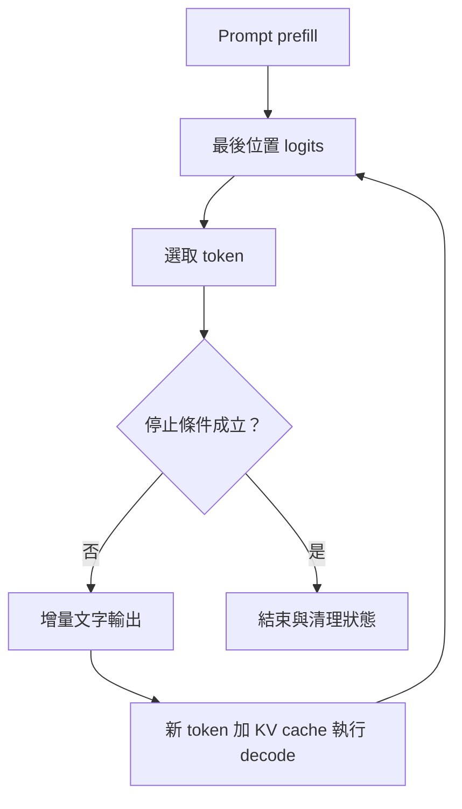

# 14｜把第一個 token 接回去，回答就開始流動

Prefill 產生第一個 token 後，系統把這個 token 當作新的輸入，沿用 KV cache 再做一次 forward，得到下一個 token 的分布。反覆執行直到遇到 EOS、輸出上限、停止條件或取消請求。

假設 prompt 有四個 token，輸出要三個：

| 階段 | 本次 forward 的新輸入 | 可選出的輸出 |
| --- | --- | --- |
| Prefill | prompt 的四個 tokens | y₁ |
| Decode 1 | y₁ | y₂ |
| Decode 2 | y₂ | y₃ |

因此普通生成 m 個輸出 token，通常是一輪 prefill 加 m−1 次單 token decode forward。最後一個輸出 token 不一定還需要餵回模型。服務與計數方式可能不同，要先定義統計邊界。

圖中的 EOS 通常不顯示為文字；達到長度上限時仍可輸出最後一個有效 token。實際實作要區分這些停止原因。

Streaming 是把結果逐步送給使用者，並不等於一次網路事件恰好包含一個 token。Tokenizer 片段可能跨 UTF-8 字元邊界，增量解碼器需要等 bytes 齊全；網路層也可能合併多個片段。

**實驗：** `python -m labs.run generation` 先印出隨機權重模型的 token IDs，再示範拆開 UTF-8 bytes 時如何還原「重力」。那些 IDs 沒有語言意義；這裡驗證的是生成迴圈。

**練習：** 每 100ms 收到一包文字，能直接推算模型每秒生成 10 tokens 嗎？

**答案：** 不能。每包可能包含多個 token，也可能是 buffered 的事件。

---

[課程首頁](../README.md) · [上一課](13-kv-cache.md) · [下一課](15-memory-budget.md)
