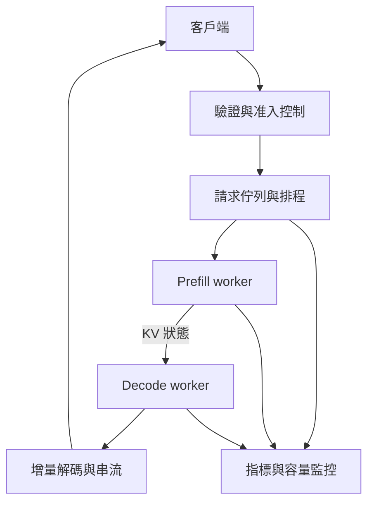

# 23｜從一個模型，到能服務團隊的系統

模型算得快，不代表服務運行得好。完整服務還要把輸入送到合適的 worker、分配記憶體、取消不用的工作，並避免不同使用者的資料互相洩漏。

圖示採 prefill/decode 分離，單機服務也可以讓兩者在同一 worker 交錯執行。分離可各自配置資源，但新增 KV 傳輸、路由與負載平衡成本。當傳輸成本大於隔離帶來的收益，拆開未必划算。

另一種重用是 prefix caching：許多請求使用同一段固定前綴時，重用其已算好的狀態。相同意思不足以命中，必須是相容的 token 前綴與模型計算狀態；key 還應考慮模型版本、adapter、位置/格式與隔離範圍。高命中率可能降低 prefill，但不會直接免除後續 decode。

多 GPU 也有不同目的。Data parallel 為不同請求提供模型副本；tensor parallel 分割層內運算並交換中間結果；pipeline parallel 分割層，處理跨階段依賴。多卡的記憶體容量可以幫助放下模型，但通訊延遲可能拖慢單請求。

對工具型 agent，模型輸出工具呼叫後還有外部執行與回傳；那段等待不能算成模型 decode 效能。RAG 則先把檢索結果加入 context，通常增加輸入長度。這兩者都是模型外的系統流程。

**練習：** 使用者已取消連線，後端仍持續生成，有何影響？

**答案：** 浪費 GPU 與 KV 容量，拖慢其他請求；取消訊號應一路傳到排程與 worker，釋放狀態並記錄原因。

**閱讀：** [DistServe](https://arxiv.org/abs/2401.09670)，關注分離 prefill/decode 的成本與 goodput 目標。

---

[課程首頁](../README.md) · [上一課](22-speculative-decoding.md) · [下一課](24-capstone.md)
